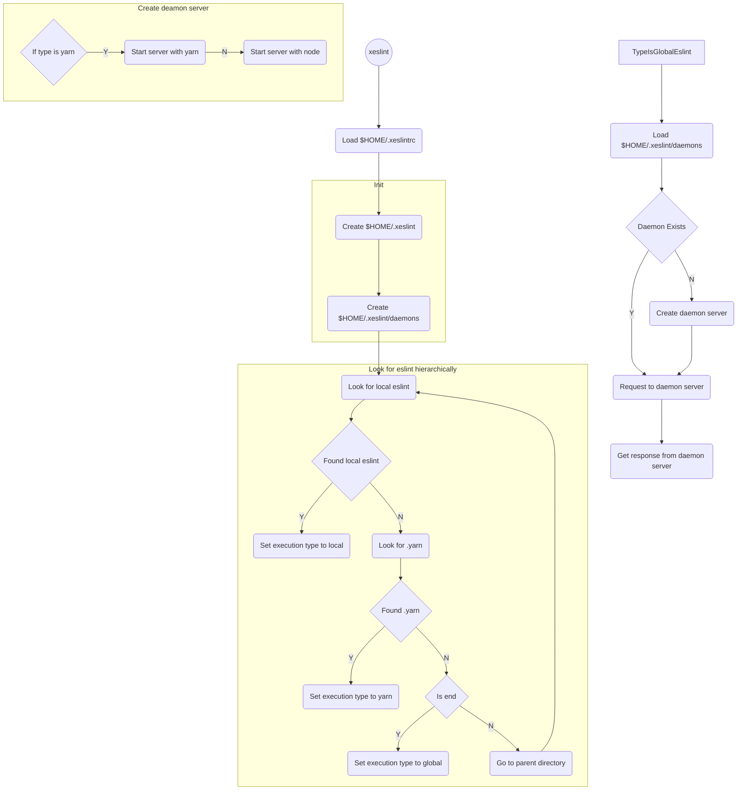

# xeslint

```mermaid
graph TD

Start((xeslint)) --> LoadConfig(Load $HOME/.xeslintrc)
    LoadConfig --> Init_A

    subgraph Init
        Init_A(Create $HOME/.xeslint)
        --> Init_B(Create $HOME/.xeslint/daemons)
    end

    Init_B --> LookForLocalEslint

    subgraph Look for eslint hierarchically
        LookForLocalEslint(Look for local eslint)
        --> FoundLocalEslint{Found local eslint}
        --> |Y| SetTypeIsLocalEslint(Set execution type to local)
        FoundLocalEslint --> |N| LookForYarn(Look for .yarn)
        --> FoundYarn{Found .yarn}
        --> |Y| SetTypeIsYarn(Set execution type to yarn)
        FoundYarn --> |N| IsEnd{Is end}
        --> |Y| SetTypeIsGlobalEslint(Set execution type to global)
        IsEnd --> |N| GoToParentDir(Go to parent directory)
        -->LookForLocalEslint
    end

    TypeIsGlobalEslint --> loadDaemonFile(Load $HOME/.xeslint/daemons)
    --> CheckDaemonExists{Daemon Exists}
    --> |Y| Request(Request to daemon server)
    CheckDaemonExists --> |N| CreateDaemon(Create daemon server ) --> Request

    subgraph Create deamon server
        TypeIsYarn{If type is yarn}
        --> |Y| StartServerWithYarn(Start server with yarn)
        --> |N| StartServerWithNode(Start server with node)
    end

    Request --> GetResponse(Get response from daemon server)
```
