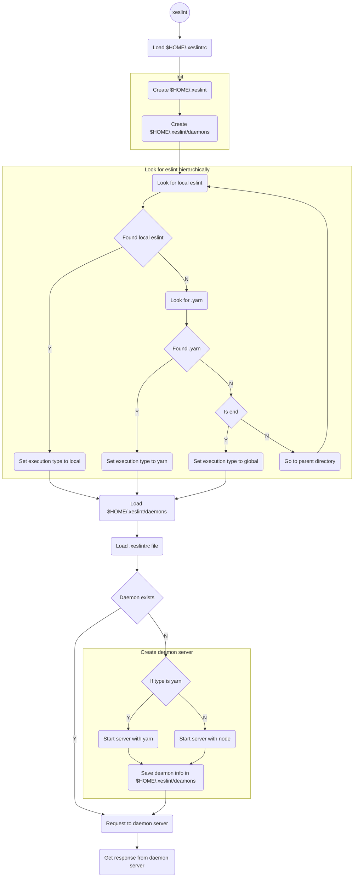

# xeslint

```mermaid
graph TD

Start((xeslint)) --> LoadConfig(Load $HOME/.xeslintrc)
    LoadConfig --> Init_A

    subgraph Init
        Init_A(Create $HOME/.xeslint)
        --> Init_B(Create $HOME/.xeslint/daemons)
    end

    Init_B --> LookForLocalEslint

    subgraph Look for eslint hierarchically
        LookForLocalEslint(Look for local eslint)
        --> FoundLocalEslint{Found local eslint}
        --> |Y| SetTypeIsLocalEslint(Set execution type to local)
        FoundLocalEslint --> |N| LookForYarn(Look for .yarn)
        --> FoundYarn{Found .yarn}
        --> |Y| SetTypeIsYarn(Set execution type to yarn)
        FoundYarn --> |N| IsEnd{Is end}
        --> |Y| SetTypeIsGlobalEslint(Set execution type to global)
        IsEnd --> |N| GoToParentDir(Go to parent directory)
        -->LookForLocalEslint
    end
    
    SetTypeIsLocalEslint --> loadDaemonFile
    SetTypeIsYarn --> loadDaemonFile
    SetTypeIsGlobalEslint --> loadDaemonFile(Load $HOME/.xeslint/daemons)
    --> LoadRCFile(Load .xeslintrc file)
    --> CheckDaemonExists{Daemon exists}
    --> |Y| Request(Request to daemon server)
    CheckDaemonExists --> |N| CreateDeamonServerIfTypeIsYarn

    subgraph Create deamon server
        CreateDeamonServerIfTypeIsYarn{If type is yarn}
        --> |Y| StartServerWithYarn(Start server with yarn)
        CreateDeamonServerIfTypeIsYarn --> |N| StartServerWithNode(Start server with node)
        StartServerWithYarn --> SaveDeamonServerInfo(Save deamon info in $HOME/.xeslint/deamons)
        StartServerWithNode --> SaveDeamonServerInfo
    end
        
    SaveDeamonServerInfo --> Request

    Request --> GetResponse(Get response from daemon server)
```
